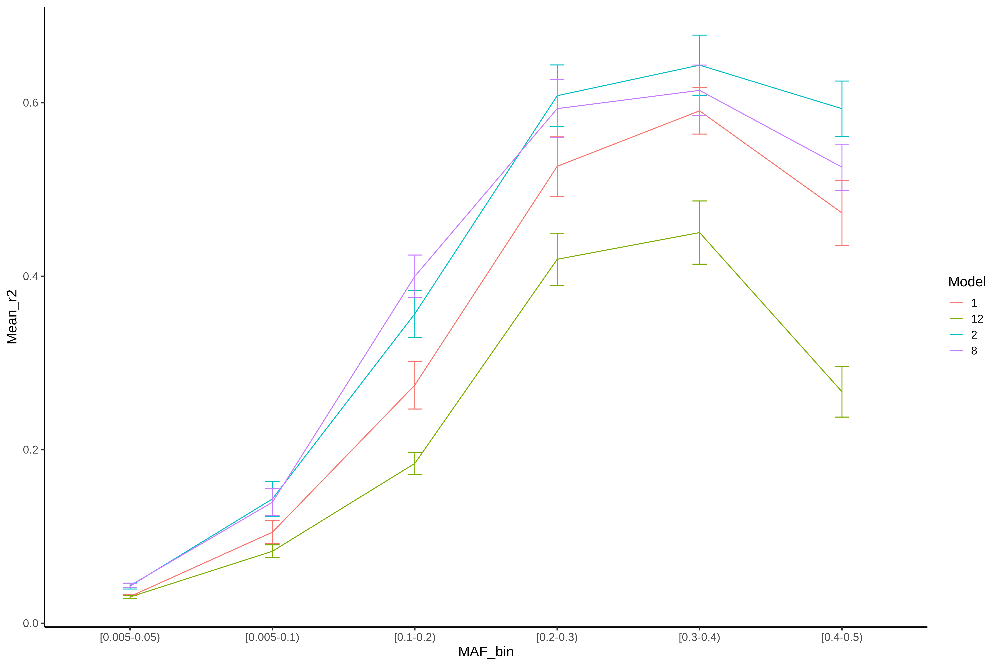
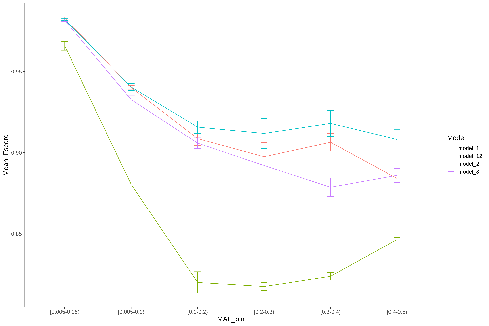
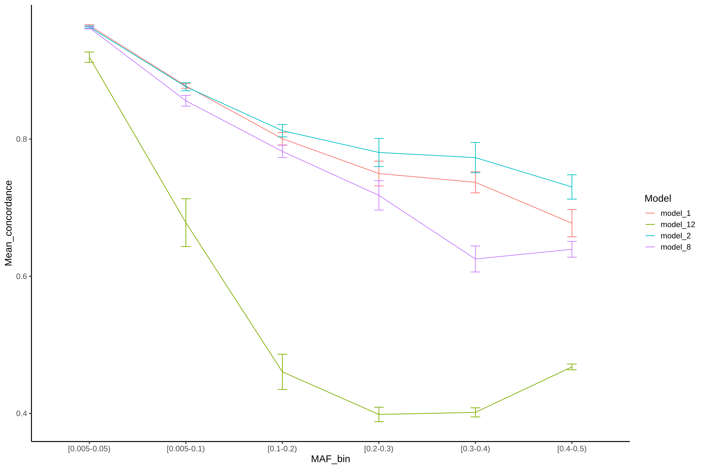
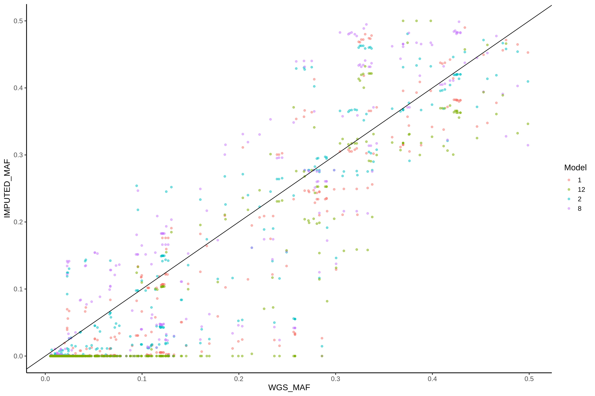
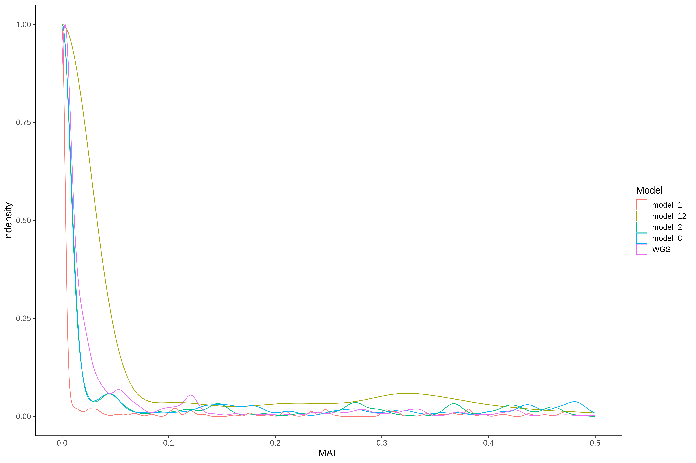
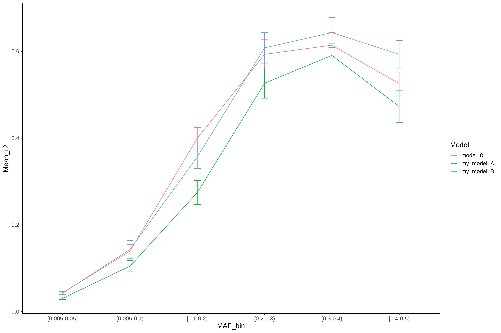

## Dependencies

- Python >=3.6
- Pytorch >=1.6 (tested on 1.08 as well)
- Samtools >=1.9
- CUDA >= 10.2

## Example files:

The example files used in this tutorial have restricted access so they were not uploaded to github.
The files can be copied from garibaldi's login01 directory at: 
```
/mnt/stsi/p1/Torkamani_Lab/Internal/raqueld/example_files/autoencoder_pytorch/examples.tar.gz
```

Copy the example files into the cloned repository folder by:
```
cd <this repository dir>
cp /mnt/stsi/p1/Torkamani_Lab/Internal/raqueld/example_files/autoencoder_pytorch/examples.tar.gz ./
tar -xvf examples.tar.gz
```

## 1. Making random hyperparameter combination sets

To generate a subset of N hyperparameters:
```
python3 pytorch_random_grid_maker.py <N>
```

For example (100 hyperparameters):
```
python3 pytorch_random_grid_maker.py 100
```

The results are 100_random_hyperparameters.tsv (hyperparameter table) and 100_random_hyperparameters.sh (command templates).
Use the generated output command template file (100_random_hyperparameters.sh) to build your command, just replacing <my_GPU_id>,  <my_input_file>,  <my_min_mask>, <my_max_mask> by their respective desired values. 
For example, this line from 100_random_hyperparameters.sh:
```
CUDA_VISIBLE_DEVICES=<my_GPU_id> python3 DSAE_TORCH_ARG.py --input <my_input_file> \
    --min_mask <my_min_mask> --max_mask <my_max_mask> --model_id model_1 \
    --l1 1e-07 --l2 1e-08 --beta 0.0001 --rho 0.05 --gamma 0.0 --disable_alpha 1 \
    --learn_rate 0.001 --activation leakyrelu --optimizer rmsprop --loss_type FL \
    --n_layers 8 --size_ratio 0.7 --decay_rate 0.5
```

Would be replaced like this, for aiming on GPU 0, my_VMV_file.vcf as input, minimum mask of 0.8, and maximum mask of 0.99:
```
CUDA_VISIBLE_DEVICES=0 python3 DSAE_TORCH_ARG.py --input my_VMV_file.vcf \
    --min_mask 0.8 --max_mask 0.99 --model_id model_1 \
    --l1 1e-07 --l2 1e-08 --beta 0.0001 --rho 0.05 --gamma 0.0 \
    --disable_alpha 1 --learn_rate 0.001 --activation leakyrelu \
    --optimizer rmsprop --loss_type FL --n_layers 8 --size_ratio 0.7 --decay_rate 0.5
```

I made a simple bash helper script that will do this replacement automatically and run all training jobs (see section 2.2).  


## 2. Train the models

### 2.1 Running training (single model example)

To run training, just execute the script DSAE_TORCH_ARG.py following the example listed bellow. For quick testing, only --input, --min_mask, and --max_mask are required (the hyperparameters will then be set to their default values).
For example:
```
CUDA_VISIBLE_DEVICES=0 python3 DSAE_TORCH_ARG.py --input my_VMV_file.vcf --min_mask 0.8 --max_mask 0.99
```
Or a more realistic example:
```
CUDA_VISIBLE_DEVICES=1 python3 DSAE_TORCH_ARG.py \
--input examples/HRC.r1-1.EGA.GRCh37.chr22.haplotypes.38708556-38866010.vcf.VMV1 \
--min_mask 0.80 --max_mask 0.99755620723362658846
```

After debugging, making sure it runs, you can play with the hyperparamters:
```
CUDA_VISIBLE_DEVICES=1 python3 DSAE_TORCH_ARG.py \
--input examples/HRC.r1-1.EGA.GRCh37.chr22.haplotypes.38708556-38866010.vcf.VMV1 \
--min_mask 0.80 --max_mask 0.99755620723362658846 --model_id best_model \
--l1 1e-07 --l2 1e-08 --beta 0.0001 --rho 0.05 --gamma 0.0 --disable_alpha 1 \
--learn_rate 0.001 --activation leakyrelu --optimizer rmsprop --loss_type FL \
--n_layers 8 --size_ratio 0.7 --decay_rate 0.5
```

The outputs will be trained model and parameters (used for inference later), listed in the output folder path (which can be customized as well):
```
ls examples/IMPUTATOR_HRC.r1-1.EGA.GRCh37.chr22.haplotypes.38708556-38866010.vcf.VMV1/
best_model_param.py  best_model.pth
```

Repeat these steps for all the different hyperparameters you want to test and all VCFs you want to train, making sure you change --model_id argment value to not overwrite your previous model.

For more details use --help:
```
python3 DSAE_TORCH_ARG.py --help
Using tabix at: /usr/bin/tabix
usage: DSAE_TORCH_ARG.py [-h] [-I INPUT] [-N MIN_MASK] [-M MAX_MASK] [-L L1]
                         [-W L2] [-B BETA] [-R RHO] [-G GAMMA]
                         [-A DISABLE_ALPHA] [-C LEARN_RATE] [-F ACTIVATION]
                         [-O OPTIMIZER] [-T LOSS_TYPE] [-D N_LAYERS]
                         [-S SIZE_RATIO] [-E DECAY_RATE] [-H MODEL_ID]
                         [-J MODEL_DIR]


optional arguments:
  -h, --help            show this help message and exit
  -I INPUT, --input INPUT
                        [str] Input file (ground truth) in VCF format
  -N MIN_MASK, --min_mask MIN_MASK
                        [float] Minimum masking ratio
  -M MAX_MASK, --max_mask MAX_MASK
                        [float] Maximum masking ratio
  -L L1, --l1 L1        [float] L1 regularization scaling factor
  -W L2, --l2 L2        [float] L2 regularization scaling factor (a.k.a.
                        weight decay)
  -B BETA, --beta BETA  [float] Beta scaling factor for sparsity loss (KL
                        divergence)
  -R RHO, --rho RHO     [float] Rho desired mean activation for sparsity loss
                        (KL divergence)
  -G GAMMA, --gamma GAMMA
                        [float] gamma modulating factor for focal loss
  -A DISABLE_ALPHA, --disable_alpha DISABLE_ALPHA
                        [0 or 1]=[false or true] whether disable alpha scaling
                        factor for focal loss
  -C LEARN_RATE, --learn_rate LEARN_RATE
                        [float] learning rate
  -F ACTIVATION, --activation ACTIVATION
                        [relu, leakyrelu, tanh, sigmoid] activation function
                        type
  -O OPTIMIZER, --optimizer OPTIMIZER
                        [adam, sgd, adadelta, adagrad] optimizer type
  -T LOSS_TYPE, --loss_type LOSS_TYPE
                        [CE or FL] whether use CE for binary cross entropy or
                        FL for focal loss
  -D N_LAYERS, --n_layers N_LAYERS
                        [int, even number] total number of layers
  -S SIZE_RATIO, --size_ratio SIZE_RATIO
                        [float(0-1]] size ratio for successive layer shrink
                        (current layer size = previous layer size *
                        size_ratio)
  -E DECAY_RATE, --decay_rate DECAY_RATE
                        [float[0-1]] learning rate decay ratio (0 = decay
                        deabled)
  -H MODEL_ID, --model_id MODEL_ID
                        [int/str] model id or name to use for saving the model
  -J MODEL_DIR, --model_dir MODEL_DIR
                        [str] path/directory to save the model
```

### 2.2. Running training (multiple models, automated run example)

I made a simple bash helper script that will generate the training commands automatically keeping a standardized file naming syntax.

- usage: 
```
bash make_training_script_from_template.sh <template.sh> <input.vcf> <max_gpus>
```

- example:
```
bash make_training_script_from_template.sh 100_random_hyperparameters.sh examples/HRC.r1-1.EGA.GRCh37.chr22.haplotypes.38708556-38866010.vcf.VMV1 4
```

- test:
```
bash make_training_script_from_template.sh 100_random_hyperparameters.sh examples/HRC.r1-1.EGA.GRCh37.chr22.haplotypes.38708556-38866010.vcf.VMV1 4
```

You will see this report giving instructions on how to run the models either sequentially or in parallel:
```
Sequential training script generated at HRC.r1-1.EGA.GRCh37.chr22.haplotypes.38708556-38866010.vcf.VMV1_100_random_hyperparameters.sh

Parallel training script for GPU 0 at HRC.r1-1.EGA.GRCh37.chr22.haplotypes.38708556-38866010.vcf.VMV1_100_random_hyperparameters.sh.GPU0.parallel.sh
Parallel training script for GPU 1 at HRC.r1-1.EGA.GRCh37.chr22.haplotypes.38708556-38866010.vcf.VMV1_100_random_hyperparameters.sh.GPU1.parallel.sh
Parallel training script for GPU 2 at HRC.r1-1.EGA.GRCh37.chr22.haplotypes.38708556-38866010.vcf.VMV1_100_random_hyperparameters.sh.GPU2.parallel.sh
Parallel training script for GPU 3 at HRC.r1-1.EGA.GRCh37.chr22.haplotypes.38708556-38866010.vcf.VMV1_100_random_hyperparameters.sh.GPU3.parallel.sh
```

Parallel run automation example, if you want to distribute multiple jobs/models per GPU.
Let's say we are running 3 models per GPU (12 models total if you have 4 GPUs, 6 if you ave 2 GPUs, etc), for example, then the parallel runs would be like:
```
nohup parallel -j 3 < HRC.r1-1.EGA.GRCh37.chr22.haplotypes.38708556-38866010.vcf.VMV1_100_random_hyperparameters.sh.GPU0.parallel.sh &
nohup parallel -j 3 < HRC.r1-1.EGA.GRCh37.chr22.haplotypes.38708556-38866010.vcf.VMV1_100_random_hyperparameters.sh.GPU1.parallel.sh &
nohup parallel -j 3 < HRC.r1-1.EGA.GRCh37.chr22.haplotypes.38708556-38866010.vcf.VMV1_100_random_hyperparameters.sh.GPU2.parallel.sh &
nohup parallel -j 3 < HRC.r1-1.EGA.GRCh37.chr22.haplotypes.38708556-38866010.vcf.VMV1_100_random_hyperparameters.sh.GPU3.parallel.sh &
```

You should test different values for parallel's -j argument to find out what is the maximum number of parallel models you will be able to run in a single GPU before reaching the VRAM or CPU bottleneck.
If you are using a cluster with SLURM/TORQUE, put the "parallel -j 3 < HRC.r1-1.EGA.GRCh37.chr22.haplotypes.38708556-38866010.vcf.VMV1_100_random_hyperparameters.sh.<gpu_id>.parallel.sh" inside a SLURM sbatch job script or TORQUE qsub script


## 3. Model validation and evaluation

### 3.1. Running inference (single model example)

For evaluating the model we must run inference on an independent dataset first, for example:
```
python3 inference_function.py pos_file.1-5  genotype_array_file.vcf model_dir --output output_name.vcf --model_name model_name --use_gpu
```

A more specific example, on ARIC:
```
cat examples/HRC.r1-1.EGA.GRCh37.chr22.haplotypes.38708556-38866010.vcf.VMV1 | grep -v "#" | cut -f1-5 > examples/HRC.r1-1.EGA.GRCh37.chr22.haplotypes.38708556-38866010.vcf.VMV1.1-5
python3 inference_function.py examples/HRC.r1-1.EGA.GRCh37.chr22.haplotypes.38708556-38866010.vcf.VMV1.1-5 \
    examples/c1_ARIC_WGS_Freeze3.lifted_already_GRCh37.GH.ancestry-1-5.chr22.phased.38708556-38866010.vcf.VMV1.masked \
    examples/IMPUTATOR_HRC.r1-1.EGA.GRCh37.chr22.haplotypes.38708556-38866010.vcf.VMV1 \
    --output examples/c1_ARIC_WGS_Freeze3.lifted_already_GRCh37.GH.ancestry-1-5.chr22.phased.38708556-38866010.vcf.VMV1.masked.gz.best_model.vcf \
    --model_name best_model --use_gpu
```

The result is the imputed VCF with the name you specified in the --output argument (e.g. examples/c1_ARIC_WGS_Freeze3.lifted_already_GRCh37.GH.ancestry-1-5.chr22.phased.38708556-38866010.vcf.VMV1.masked.gz.best_model.vcf).

For additional info run the help mode with --help flag:
```
python3 inference_function.py --help
Using tabix at: /usr/bin/tabix
usage: inference_function.py [-h] --model_name model_name [--output output]
                             [--use_gpu] [--debug]
                             reference.1-5 genotype_array model_dir


Imputation Inference Script.


positional arguments:
  reference.1-5         First 5 columns of reference panel VCF file
                        (chromosome position rsID REF ALT), used to build
                        imputed file
  genotype_array        Genotype array file in VCF format, file to be imputed
  model_dir             Pre-trained model directory path (just directory path,
                        no file name and no extension required


optional arguments:
  -h, --help            show this help message and exit
  --model_name model_name
                        model name to load which is located under model_dir ,
                        for multi-model support
  --output output       (Optional) An output file location (can be either a
                        file or a directory), imputed file in VCF format, same
                        name prefix as input if no out name is provided
  --use_gpu             Whether or not to use the GPU (default=False)
  --debug               Add predicted accuracies to the output for debugging
                        (default=False)
```

### 3.2. Running inference (multiple models, automated run example)

I made a command line generator for the inference function, so you don't need to run model by model manually.
You can run the inference command generator by:

```
bash make_inference_commands.sh

usage: bash make_inference_commands.sh <model_dir> <pos_file.1-5> <ga_dir> <out_dir>

example: bash make_inference_commands.sh /raid/pytorch_random_search/models/IMPUTATOR_HRC.r1-1.EGA.GRCh37.chr22.haplotypes.38708556-38866010.vcf.VMV1 /raid/chr22/HRC.r1-1.EGA.GRCh37.chr22.haplotypes.38708556-38866010.vcf.VMV1.1-5 /raid/ARIC/ARIC_chr22_ground_truth_5_phase_VMV_376a1_376a5_merged_AFFY6 ./inference_output

<model_dir>: directory where the model files (*.pth) are.
<pos_file.1-5>: position file, first 5 columns of the VCF file used for training (see README.md section 3.1)
<ga_dir>: genotype array (or "masked") directory.
<out_dir>: output directory.

```

More specific example:
```
bash make_inference_commands.sh examples/IMPUTATOR_HRC.r1-1.EGA.GRCh37.chr22.haplotypes.38708556-38866010.vcf.VMV1 /raid/chr22/HRC.r1-1.EGA.GRCh37.chr22.haplotypes.38708556-38866010.vcf.VMV1.1-5 /raid/ARIC/ARIC_chr22_ground_truth_5_phase_VMV_376a1_376a5_merged_AFFY6 examples/inference_output
Inference script generated at /raid/pytorch_random_search_github/examples/inference_output/run_inference.sh
```

To run inferences sequentially:
```
cd examples/inference_output; bash run_inference.sh
```

To run inferences in parallel:
```
cd examples/inference_output; parallel -j 4 < run_inference.sh
```

You should be able to see the new vcf files generated (in this example we are showing just one file, but you will have as many files as the number of models you trained):
```
ls -l *.vcf
-rw-rw-r-- 1 raqueld raqueld 90865666 Oct 23 10:43 c1_ARIC_WGS_Freeze3.lifted_already_GRCh37.GH.ancestry-1-5.chr22.phased.38708556-38866010.vcf.VMV1.masked.imputed.best_model.vcf
```

IMPORTANT: when training multiple models it is important to keep model_id (i.e. model_1, model_2, ..., model_100) in the file name. Use the model id as a suffix like *.best_model.vcf. If you are running the automated scripts listed in this guide, they will take care of the model syntax and you don't need to worry about it.


### 3.3. Run evaluation of the imputed results (single model example)

Compress model and tabix it first, for example:
```
bgzip -c examples/c1_ARIC_WGS_Freeze3.lifted_already_GRCh37.GH.ancestry-1-5.chr22.phased.38708556-38866010.vcf.VMV1.masked.gz.best_model.vcf > examples/c1_ARIC_WGS_Freeze3.lifted_already_GRCh37.GH.ancestry-1-5.chr22.phased.38708556-38866010.vcf.VMV1.masked.gz.best_model.vcf.gz
tabix -f -p vcf examples/c1_ARIC_WGS_Freeze3.lifted_already_GRCh37.GH.ancestry-1-5.chr22.phased.38708556-38866010.vcf.VMV1.masked.gz.best_model.vcf.gz
```
Then run the accuracy calculator, for example:
```
python3 Compare_imputation_to_WGS.py --wgs wgs_file.vcf --imputed imputed_file.vcf \
    --ref ref_file.vcf --ga ga_file.vcf --sout per_sample_output.tsv --vout per_variant_output.tsv
```
More specific example:
```
python3 Compare_imputation_to_WGS.py \
    --wgs examples/c1_ARIC_WGS_Freeze3.lifted_already_GRCh37.GH.ancestry-1-5.chr22.phased.38708556-38866010.vcf.VMV1.gz  \
    --imputed  examples/c1_ARIC_WGS_Freeze3.lifted_already_GRCh37.GH.ancestry-1-5.chr22.phased.38708556-38866010.vcf.VMV1.masked.gz.best_model.vcf.gz \
    --ref examples/HRC.r1-1.EGA.GRCh37.chr22.haplotypes.38708556-38866010.vcf.VMV1.gz \
    --ga examples/c1_ARIC_WGS_Freeze3.lifted_already_GRCh37.GH.ancestry-1-5.chr22.phased.38708556-38866010.vcf.VMV1.masked.gz \
    --sout examples/c1_ARIC_WGS_Freeze3.lifted_already_GRCh37.GH.ancestry-1-5.chr22.phased.38708556-38866010.vcf.VMV1.masked.gz.best_model.vcf.gz_per_sample_tsv \
    --vout examples/c1_ARIC_WGS_Freeze3.lifted_already_GRCh37.GH.ancestry-1-5.chr22.phased.38708556-38866010.vcf.VMV1.masked.gz.best_model.vcf.gz_per_variant.tsv
```

Results will show...

Results per sample at: 
```
examples/c1_ARIC_WGS_Freeze3.lifted_already_GRCh37.GH.ancestry-1-5.chr22.phased.38708556-38866010.vcf.VMV1.masked.gz.best_model.vcf.gz_per_sample_tsv
```

Results per variant at: 
```
examples/c1_ARIC_WGS_Freeze3.lifted_already_GRCh37.GH.ancestry-1-5.chr22.phased.38708556-38866010.vcf.VMV1.masked.gz.best_model.vcf.gz_per_variant.tsv
```

Use --help flag for additional help:
```
python3 Compare_imputation_to_WGS.py --help
usage: Compare_imputation_to_WGS.py --ga <input_genotype_array.vcf.gz> --imputed <imputed_file.vcf.gz> --wgs <whole_genome_file.vcf.gz>
Use -h or --help to display help.


optional arguments:
  -h, --help            show this help message and exit
  --ga GA               (optional for low pass) path to genotype array file in
                        vcf.gz format, with tbi
  --wgs WGS             path to whole genome file in vcf.gz format, with tbi
  --imputed IMPUTED     path to imputed file in vcf.gz format, with tbi
  --ref REF             optional, path to reference panel file in vcf.gz
                        format, with tbi. Used for MAF calculation. WGS file
                        will be used if no reference file is provided.
  --max_total_rows MAX_TOTAL_ROWS
                        maximun number of rows or variants to be loaded
                        simultaneously, summing all chunks loaded by all cores
  --max_per_core MAX_PER_CORE
                        maximun number of variants per chunk per core, lower
                        it to avoid RAM overload
  --min_per_core MIN_PER_CORE
                        minimun number of variants per chunk per core,
                        increase to avoid interprocess communication overload
  --sout SOUT           optional output file path/name per sample, default is
                        the same as the imputed file with
                        _per_sample_results.txt suffix
  --vout VOUT           optional output file path/name per variant, default is
                        the same as the imputed file with
                        _per_variant_results.txt suffix
  --xmode XMODE         Option for developers, print additional scores.
```


### 3.4. Run evaluation of the imputed results (multiple models, automated run example)

I made a command lime generator for the model evaluation function, so you don't need to run model by model manually.
You can run the evaluation command generator by:


```
bash make_evaluation_commands.sh

usage: bash make_inference_commands.sh <imputed_dir> <ga_dir> <wgs_dir> <out_dir>

example: bash make_evaluation_commands.sh /raid/pytorch_random_search/inference_output /raid/ARIC/ARIC_chr22_ground_truth_5_phase_VMV_376a1_376a5_merged_AFFY6 /raid/ARIC/ARIC_chr22_ground_truth_5_phase_VMV_376a1_376a5_merged .

<imputed_dir> directory where the inference results were generated (this script supports results from make_inference_commands.sh only!).
<ga_dir> directory were the genotype array or "masked" input files are (files used as input by the inference function.
<wgs_dir> directory where the ground truth WGS files are.
<out_dir> directory where to save the evaluation results.

```

More specific example:

```
bash make_evaluation_commands.sh examples/inference_output examples/ examples/ evaluation_output
Evaluation script generated at /raid/pytorch_random_search_github/evaluation_output/run_evaluation.sh
```

To run evaluations sequentially:
```
cd /raid/pytorch_random_search_github/evaluation_output; bash run_evaluation.sh
```

To run inferences in parallel:
```
cd /raid/pytorch_random_search_github/evaluation_output; parallel -j 4 < run_evaluation.sh
```

You will reports like this on the screen:
```
Processing  752 imputed samples
Processing chunk: 1 Max rows per chunk: 10000
1 Read imputed file time:  0.9586371723562479
2 Chunking time:  0.0001266980543732643
3 Calculation time:  1.8527713362127542
4 Merging calculations per sample time:  0.06603083945810795
Results per sample at: /raid/pytorch_random_search_github/evaluation_output/c1_ARIC_WGS_Freeze3.lifted_already_GRCh37.GH.ancestry-1-5.chr22.phased.38708556-38866010.vcf.VMV1.masked.imputed.best_model.vcf_per_sample.tsv
Results per variant at: /raid/pytorch_random_search_github/evaluation_output/c1_ARIC_WGS_Freeze3.lifted_already_GRCh37.GH.ancestry-1-5.chr22.phased.38708556-38866010.vcf.VMV1.masked.imputed.best_model.vcf_per_variant.tsv
Total run time (sec): 2.8827220732346177

```

The results are stored in the *_per_variant.tsv and *_per_sample.tsv files.

IMPORTANT: when doing inference/evaluation across multiple models it is important to keep model_id (i.e. model_1, model_2, ..., model_100) in the file name. Use the model id as a suffix like *.best_model.vcf_per_variant.tsv. If you are running the automated scripts listed in this guide, they will take care of the file name syntax and you don't need to worry about it. Please use --custom_names and --custom files if you have filenames with custom syntax if you have files that were not generated by steps 2.2, 3.2 and 3.4.

## 4. Plotting results

WARNING! This tool only works if you followed steps 2.2, 3.2 and 3.4! It fails without the file naming syntax generated in those steps. Otherwise you have to use the custom flags only, no positional arguments.

The input files are the per variant metrics generated in pre previous step (--vout output files).
```
Rscript plot_evaluation_results_per_variant.R

Usage:
    Rscript plot_evaluation_results_per_variant.R <tsv_files> <options>
Example:
    Rscript plot_evaluation_results_per_variant.R ./evaluation_results/*_per_variant.tsv --threshold 0.95 --custom_files custom_file1.tsv custom_file2.tsv --custom_names custom_name1 custom_name2
Positional arguments:
    <tsv_files> Evaluation result file names(s), multiple files supported.
Options (all optional):
    --threshold [float]: Minimum correlation threshold (WGS vs imputed MAF correl) between -1 and 1, default=0.90
    --custom_files [str, list]: list of custom evaluation results from other tools
    --custom_names [str, list]: list of names for the custom evaluation results from other tools (i.e. minimac)
```

For example:
```
Rscript plot_evaluation_results_per_variant.R c1_ARIC_WGS_Freeze3.lifted_already_GRCh37.GH.ancestry-1-5.chr22.phased.38708556-38866010.vcf.VMV1.masked.imputed.best_model.vcf_per_variant.tsv
```

The \*.imputed.\* and \*.vcf_per_variant.tsv prefixes an suffixes are required to make this plotting script work. For example, this command would fail because of the wrong file naming syntax!!!
```
Rscript plot_evaluation_results_per_variant.R examples/c1_ARIC_WGS_Freeze3.lifted_already_GRCh37.GH.ancestry-1-5.chr22.phased.38708556-38866010.vcf.VMV1.masked.gz.best_model.vcf.gz_per_variant.tsv
```

Multiple files can be specified at once using asterisk, for example:
```
Rscript plot_evaluation_results_per_variant.R ./plots/*per_variant.tsv
```

Another example using optional arguments: output directory (--out_dir), custom title for the plots (--custom_title), and custom r-squared filtering threshold (--threshold)
```
Rscript plot_evaluation_results_per_variant.R plots/*_per_variant*.tsv --out_dir plots --custom_title "chr22:38708556-38866010" --threshold -1
```

You will see an output report like this, shwoing instructions on where to find the results:
```
[1] "Saving summary results per MAF bin in plots/results_per_MAF_bin.tsv"
[1] "Saving overall summary results per model in plots/overall_results_per_model.tsv"
[1] "Saving MAF correl results in plots/MAF_correls.tsv"
[1] "Saving plot 1 in plots/p1.pdf"
[1] "Saving plot 1 in plots/p1.png"
[1] "Saving plot 2 in plots/p2.pdf"
[1] "Saving plot 2 in plots/p2.png"
[1] "Saving plot 3 in plots/p3.pdf"
[1] "Saving plot 3 in plots/p3.png"
[1] "Saving plot 4 in plots/p4.pdf"
[1] "Saving plot 4 in plots/p4.png"
[1] "Saving plot 5 in plots/p5.pdf"
[1] "Saving plot 5 in plots/p5.png"
```

Only results with IMPUTED_MAF versus WGS_MAF correlation higher than 0.90 (or custom threshold, if provided) will be displayed (to avoid plotting artifacts). But you can change that threshold using --threshold option.
If you provide multiple --vout output files at one run, you will see multiple accuracy curves. 







Example using custom evaluation results and model names from external tools:

```
Rscript plot_evaluation_results_per_variant.R plots/c1_ARIC_WGS_Freeze3.lifted_already_GRCh37.GH.ancestry-1-5.chr22.phased.38708556-38866010.vcf.VMV1.masked.imputed.model_8.vcf_per_variant.tsv --custom_files plots/c1_ARIC_WGS_Freeze3.lifted_already_GRCh37.GH.ancestry-1-5.chr22.phased.38708556-38866010.vcf.VMV1.masked.imputed.model_1.vcf_per_variant.tsv plots/c1_ARIC_WGS_Freeze3.lifted_already_GRCh37.GH.ancestry-1-5.chr22.phased.38708556-38866010.vcf.VMV1.masked.imputed.model_2.vcf_per_variant.tsv --custom_names my_model_A my_model_B --threshold 0.90
```



## 5. Picking the best model and running full training for it

In case you didn't run full training with automatic stop (i.e. reduce --max_epochs to 500 to speedup grid search). I made this script to help you to automatically select the best model using r-squared per feature as criteria.
This step depends on the results from all the previous steps, and this step only applies if you used --max_epochs argument to reduce the number of epochs during the training steps. 
If you didn't --max_epochs in the training step, then it means you already ran full training and this step is not necessary. 

You can run the script without arguments to show its usage:
```
bash pick_best_model_for_full_training.sh

usage: bash pick_best_model_for_full_training.sh <overall_results_per_model> <training_script>

    <overall_results_per_model>: summary file generated by the plotting script (plot_evaluation_results_per_variant.R), more specifically: overall_results_per_model.tsv
    <training_script>: the training script you generated from make_training_script_from_template.sh, before splitting by GPU
```

A more explicit example:
```
bash pick_best_model_for_full_training.sh plots/overall_results_per_model.tsv plots/HRC.r1-1.EGA.GRCh37.chr22.haplotypes.38708556-38866010.vcf.VMV1_100_random_hyperparameters_500epochs.sh
```

The command should show a report like this:
```
Best model is model_2, new full training model name: model_2_F
Full training script created at plots/HRC.r1-1.EGA.GRCh37.chr22.haplotypes.38708556-38866010.vcf.VMV1_100_random_hyperparameters_500epochs.sh.best
```

The new training script will look like this:
```
cat plots/HRC.r1-1.EGA.GRCh37.chr22.haplotypes.38708556-38866010.vcf.VMV1_100_random_hyperparameters_500epochs.sh.best
CUDA_VISIBLE_DEVICES=1 python3 DSAE_TORCH_ARG.py --input /raid/chr22/HRC.r1-1.EGA.GRCh37.chr22.haplotypes.38708556-38866010.vcf.VMV1 --min_mask 0.80 --max_mask 0.99755620723362658846 --model_id model_2_F --l1 0.0 --l2 0.01 --beta 0.0 --rho 0.5 --gamma 4.0 --disable_alpha 1 --learn_rate 0.01 --activation leakyrelu --optimizer rmsprop --loss_type CE --n_layers 6 --size_ratio 0.9 --decay_rate 0.25 --max_epochs 50000
```

You can use that script to run full training for the best model found (model_2, in this toy example), similar to training step (see step 2), but now for a single model.
